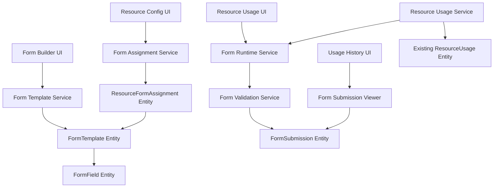

# Design Document

## Overview

The Resource Usage Forms feature introduces a comprehensive form management system that allows administrators to create custom forms for resource usage actions (start, stop, takeover). The system consists of three main components:

1. **Form Builder**: A WYSIWYG editor for creating and managing forms
2. **Form Runtime**: Integration with existing resource usage workflows to display and process forms
3. **Form Submissions Management**: Storage and viewing of form submission data

The feature integrates seamlessly with the existing resource management system, extending the current `ResourceUsage` workflow without disrupting existing functionality.

### Centralized Template Benefits

The centralized template approach provides several key advantages:

1. **Reusability**: Create a form template once and assign it to multiple resources
2. **Consistency**: Ensure identical resources use the same forms and procedures
3. **Maintenance**: Update a template once to affect all assigned resources
4. **Fleet Management**: Easily manage forms for large numbers of similar resources
5. **Flexibility**: Mix and match different templates for different action types on the same resource

## Architecture

### Database Schema Extensions

The system requires four new database entities:

1. **FormTemplate**: Stores reusable form definitions that can be shared across resources
2. **FormField**: Stores individual form field configurations for templates
3. **ResourceFormAssignment**: Links form templates to specific resources and action types
4. **FormSubmission**: Stores completed form submissions with their data

### Component Architecture



### Integration Points

The system integrates with existing components:

- **Resource Management**: Forms are associated with specific resources and action types
- **Resource Usage Service**: Modified to check for required forms before executing actions
- **Usage History**: Extended to display form submission indicators and viewers
- **Permission System**: Leverages existing resource management permissions

## Components and Interfaces

### Backend Components

#### 1. FormTemplate Entity
```typescript
@Entity()
export class FormTemplate {
  @PrimaryGeneratedColumn()
  id: number;

  @Column()
  name: string;

  @Column({ type: 'text', nullable: true })
  description: string;

  @Column({ type: 'boolean', default: true })
  isActive: boolean;

  @OneToMany(() => FormField, field => field.template, { cascade: true })
  fields: FormField[];

  @OneToMany(() => ResourceFormAssignment, assignment => assignment.template)
  assignments: ResourceFormAssignment[];

  @CreateDateColumn()
  createdAt: Date;

  @UpdateDateColumn()
  updatedAt: Date;
}
```

#### 2. FormField Entity
```typescript
@Entity()
export class FormField {
  @PrimaryGeneratedColumn()
  id: number;

  @Column()
  templateId: number;

  @Column()
  fieldKey: string;

  @Column()
  label: string;

  @Column({ type: 'simple-enum', enum: ['text', 'textarea', 'boolean', 'select', 'number'] })
  fieldType: 'text' | 'textarea' | 'boolean' | 'select' | 'number';

  @Column({ type: 'json', nullable: true })
  options: any; // For select fields, validation rules, etc.

  @Column({ type: 'boolean', default: false })
  required: boolean;

  @Column({ type: 'integer' })
  sortOrder: number;

  @ManyToOne(() => FormTemplate, template => template.fields, { onDelete: 'CASCADE' })
  template: FormTemplate;
}
```

#### 3. ResourceFormAssignment Entity
```typescript
@Entity()
export class ResourceFormAssignment {
  @PrimaryGeneratedColumn()
  id: number;

  @Column()
  resourceId: number;

  @Column()
  templateId: number;

  @Column({ type: 'simple-enum', enum: ['start', 'stop', 'takeover'] })
  actionType: 'start' | 'stop' | 'takeover';

  @Column({ type: 'boolean', default: true })
  isActive: boolean;

  @ManyToOne(() => Resource, { onDelete: 'CASCADE' })
  resource: Resource;

  @ManyToOne(() => FormTemplate, template => template.assignments, { onDelete: 'CASCADE' })
  template: FormTemplate;

  @Column({ type: 'integer', default: 0 })
  sortOrder: number; // For ordering multiple forms for the same action

  @CreateDateColumn()
  createdAt: Date;

  @UpdateDateColumn()
  updatedAt: Date;
}
```

#### 4. FormSubmission Entity
```typescript
@Entity()
export class FormSubmission {
  @PrimaryGeneratedColumn()
  id: number;

  @Column()
  templateId: number;

  @Column()
  resourceUsageId: number;

  @Column()
  userId: number;

  @Column({ type: 'json' })
  submissionData: Record<string, any>;

  @CreateDateColumn()
  submittedAt: Date;

  @ManyToOne(() => FormTemplate, { onDelete: 'CASCADE' })
  template: FormTemplate;

  @OneToOne(() => ResourceUsage, { onDelete: 'CASCADE' })
  resourceUsage: ResourceUsage;

  @ManyToOne(() => User)
  user: User;
}
```

#### 5. Form Template Service
```typescript
@Injectable()
export class FormTemplateService {
  async createTemplate(templateData: CreateTemplateDto): Promise<FormTemplate>
  async updateTemplate(templateId: number, templateData: UpdateTemplateDto): Promise<FormTemplate>
  async deleteTemplate(templateId: number): Promise<void>
  async getAllTemplates(): Promise<FormTemplate[]>
  async getTemplateById(templateId: number): Promise<FormTemplate>
}
```

#### 6. Form Assignment Service
```typescript
@Injectable()
export class FormAssignmentService {
  async assignTemplateToResource(resourceId: number, templateId: number, actionType: string): Promise<ResourceFormAssignment>
  async removeAssignment(assignmentId: number): Promise<void>
  async getAssignmentsByResource(resourceId: number): Promise<ResourceFormAssignment[]>
  async getAssignmentsByResourceAndAction(resourceId: number, actionType: string): Promise<ResourceFormAssignment[]>
  async bulkAssignTemplate(templateId: number, assignments: Array<{resourceId: number, actionType: string}>): Promise<void>
}
```

#### 7. Form Submission Service
```typescript
@Injectable()
export class FormSubmissionService {
  async processFormSubmissions(forms: Record<string, any>, resourceUsageId: number, userId: number): Promise<FormSubmission[]>
  async getSubmissionsByUser(userId: number): Promise<FormSubmission[]>
  async getSubmissionsByResource(resourceId: number): Promise<FormSubmission[]>
  async getSubmissionByUsageId(usageId: number): Promise<FormSubmission | null>
}
```

#### 8. Updated Resource Usage DTOs
```typescript
// Extended existing DTOs to include optional form data
export class StartUsageSessionDto {
  notes?: string;
  forceTakeOver?: boolean;
  forms?: Record<string, any>; // Dictionary of form submissions keyed by template ID
}

export class EndUsageSessionDto {
  notes?: string;
  forms?: Record<string, any>; // Dictionary of form submissions keyed by template ID
}
```

### Frontend Components

#### 1. Form Template Builder Interface
- **TemplateBuilderEditor**: Main WYSIWYG editor component for creating reusable templates
- **TemplateLibrary**: Component for browsing and managing existing templates
- **FieldTypeSelector**: Component for selecting field types
- **FieldPropertiesPanel**: Configuration panel for field properties
- **FormPreview**: Real-time preview of the form
- **DragDropFieldList**: Reorderable list of form fields

#### 2. Form Assignment Interface
- **ResourceFormAssignmentPanel**: Interface for assigning templates to resources
- **BulkAssignmentTool**: Tool for assigning templates to multiple resources at once
- **AssignmentOverview**: View showing which templates are assigned to which resources

#### 3. Form Runtime Interface
- **DynamicForm**: Renders forms based on configuration
- **FormFieldRenderer**: Renders individual form fields
- **FormValidator**: Client-side validation logic
- **FormSubmissionHandler**: Handles form submission and API calls

#### 4. Form Submission Viewer
- **SubmissionModal**: Modal for viewing form submissions
- **SubmissionDataDisplay**: Formatted display of submission data
- **SubmissionHistoryButton**: Button in usage history table

## Data Models

### Form Template Schema
```typescript
interface FormTemplate {
  id: number;
  name: string;
  description?: string;
  isActive: boolean;
  fields: FormFieldConfiguration[];
  assignments: ResourceFormAssignment[];
}

interface ResourceFormAssignment {
  id: number;
  resourceId: number;
  templateId: number;
  actionType: 'start' | 'stop' | 'takeover';
  isActive: boolean;
  resource: Resource;
  template: FormTemplate;
}

interface FormFieldConfiguration {
  id: number;
  fieldKey: string;
  label: string;
  fieldType: 'text' | 'textarea' | 'boolean' | 'select' | 'number';
  required: boolean;
  sortOrder: number;
  options?: {
    selectOptions?: Array<{ value: string; label: string }>;
    validation?: {
      minLength?: number;
      maxLength?: number;
      min?: number;
      max?: number;
      pattern?: string;
    };
    placeholder?: string;
    helpText?: string;
  };
}
```

### Form Submission Schema
```typescript
interface FormSubmissionData {
  id: number;
  templateId: number;
  resourceUsageId: number;
  userId: number;
  submissionData: Record<string, any>;
  submittedAt: Date;
  template: FormTemplate;
  user: User;
}
```

## Error Handling

### Backend Error Handling
- **FormNotFoundException**: When a form is not found
- **InvalidFormDataException**: When form submission data is invalid
- **FormValidationException**: When form validation fails
- **DuplicateFormException**: When trying to create duplicate forms for same resource/action

### Frontend Error Handling
- Form validation errors displayed inline
- Network errors shown as toast notifications
- Graceful degradation when forms fail to load
- Retry mechanisms for failed submissions

### Validation Strategy
- **Client-side**: Immediate feedback for user experience using Zod schemas
- **Server-side**: Authoritative validation for security using Zod schemas
- **Schema validation**: Using Zod for consistent type safety across frontend and backend

## Testing Strategy

### Unit Tests
- Form builder component functionality
- Form validation logic
- Form submission processing
- Database entity operations

### Integration Tests
- Form creation and management workflows
- Form submission and retrieval
- Resource usage integration
- Permission-based access control

### End-to-End Tests
- Complete form creation workflow
- Resource usage with form requirements
- Form submission viewing
- Multi-user form access scenarios

### Test Data Strategy
- Factory patterns for creating test forms
- Mock form submissions for UI testing
- Isolated test database for integration tests
- Cypress tests for complete user workflows