# Reader login and resource actions

Scanning an NFC card keeps the resource list open. Every authenticated row has
two equal, flush targets: resource details on the left and the permitted action
on the right. A reader with one resource still shows the list. The shared list
and details header shows the user, logout and the remaining 30-second login.
Reader logout does not end machine usage.

Details and the NFC prompt place an icon-only back control at the far left of
the header. Header buttons retain their bounds when pressed, so their rounded
corners stay visible. Usernames truncate independently of the countdown and
network badge.

Tapping a resource before scanning instead opens the NFC prompt and then that
resource's details. Returning to the list retains the login. Quick start uses no
project; the details screen retains project selection and explicit takeover.

## Flow

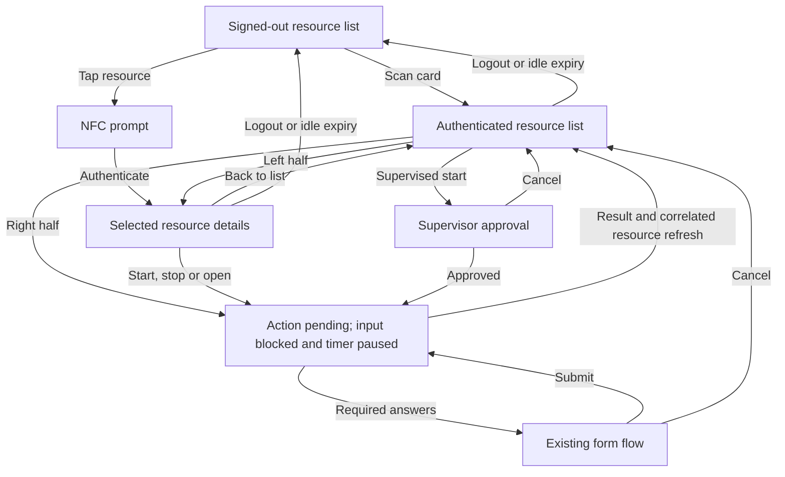

Actions begun in details return to details; actions begun in the list return to
the list. A pending action also blocks the passive maintenance-drawer gesture.
An unrelated resource broadcast cannot complete an action's refresh. Delayed
results and form requests from a previous action are ignored.

## Production application screenshots

These 480 × 480 screenshots come from the production LVGL screens, Application,
API parser, screen router and virtual NFC implementation. The server transport
and display hardware are test substitutes; the network badge is a fixture.
They are native framebuffer captures, not browser or physical-device photos.

| State | Screenshot |
| --- | --- |
| Single resource, signed out | 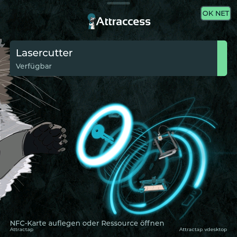 |
| Scan first: authenticated list | 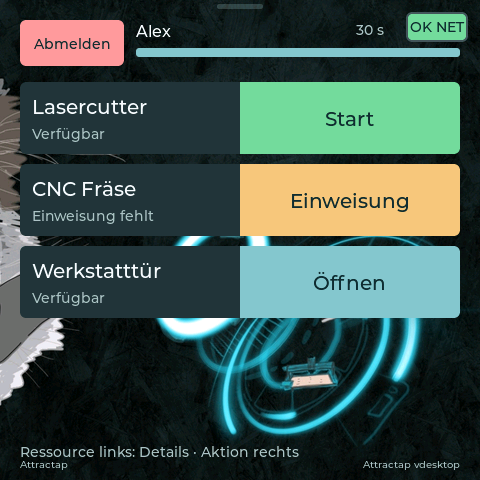 |
| Pending start, blocked input and paused timer | 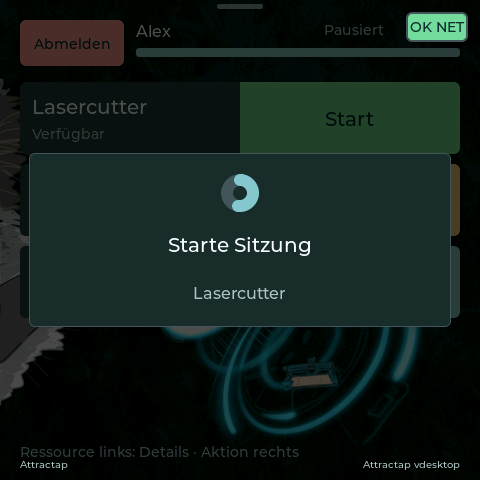 |
| Successful start | 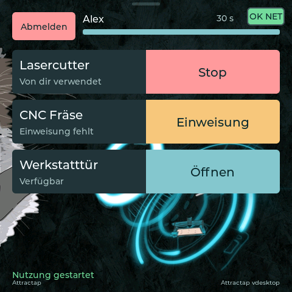 |
| Running usage details with shared header |  |
| Pressed back and logout controls retain their complete outlines | 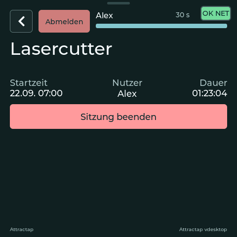 |
| Required end form loading | 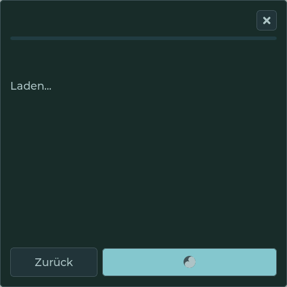 |
| Required end form ready |  |
| Completed form and stop |  |
| Logout preserves running usage |  |
| Resource first: NFC prompt | 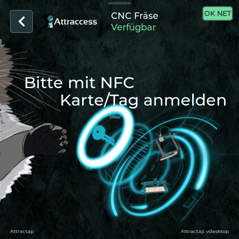 |
| Resource first: missing introduction | 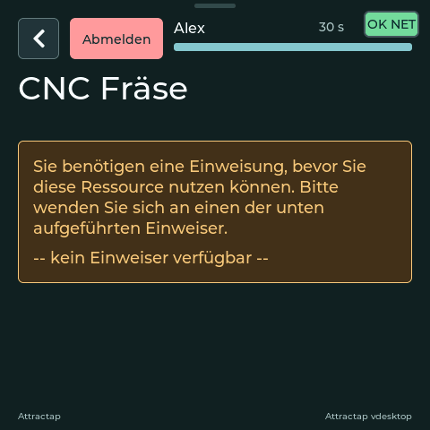 |
| Failed door action, injected server error | 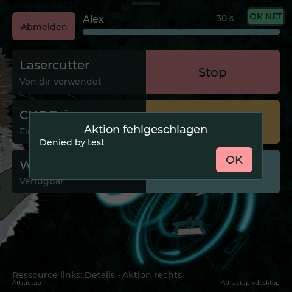 |
| Supervisor request |  |
| Reconnection returns to signed-out list | 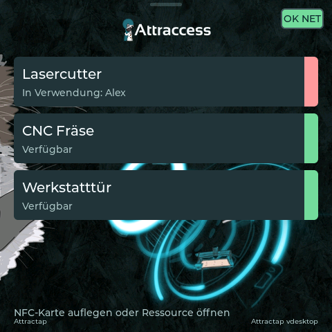 |

## Isolated screen states

The display-theme harness additionally renders the resource list directly.
These fixtures omit the application-level network badge and exercise permission
and countdown states independently of the server journey.

| State | Screenshot |
| --- | --- |
| Signed out | 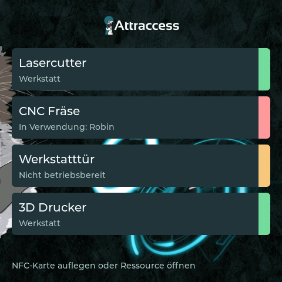 |
| Authenticated actions | 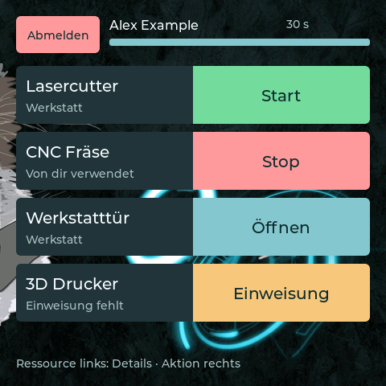 |
| Pending action | 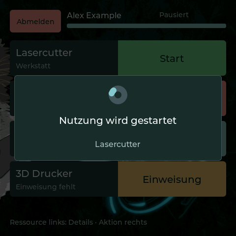 |
| Completed action | 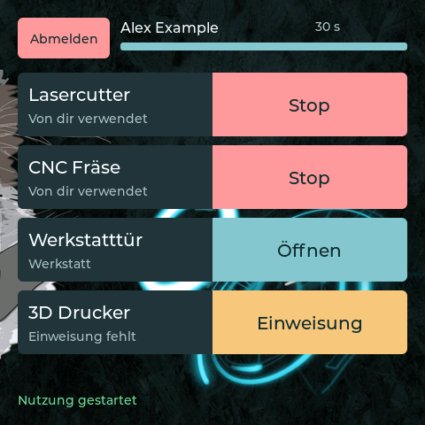 |
| Supervision, occupied, blocked and missing introduction | 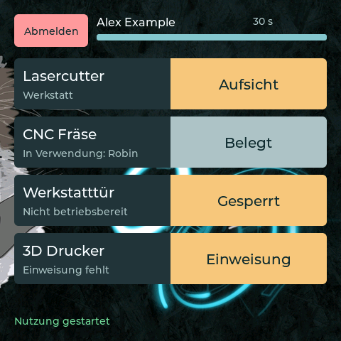 |
| Personal permissions loading | 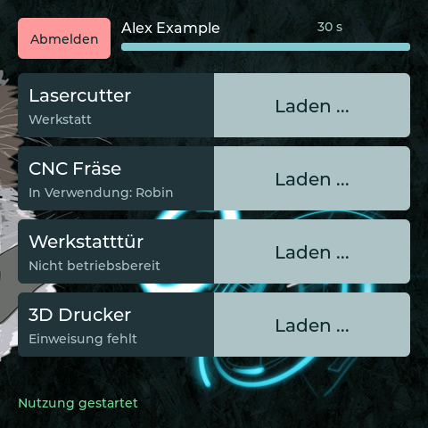 |
| Four seconds before login expiry | 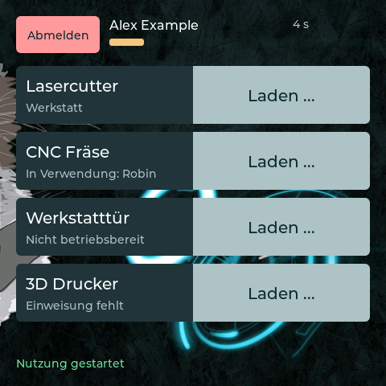 |

## Reproducing the checks

From the repository root:

```sh
pnpm nx build attractap-desktop
pnpm nx test attractap-desktop
pnpm nx test attractap-firmware
pnpm precommit
python3 apps/attractap/firmware/build_firmwares.py
```

The desktop tests include a real-clock timeout test (about 134 seconds), covering
idle logout without stopping usage, pausing the login timeout during a pending
action, the separate refresh deadline after an action timeout, and recovery
after lifting the NFC card during authentication. The normal
journey also covers required-form cancellation/submission, supervision
cancellation, duplicate taps, delayed responses, out-of-order resource refreshes
and reconnect cleanup. It exercises full-length usernames and authentication
arriving before the personalized list, including same-user relogin and
resource-first supervision. API tests cover personalized resource permissions,
batched maintenance grants, per-resource supervision, correlation, authorization
failures, and supplemental list failures during authentication.

To save fresh packed RGBA8 framebuffers for conversion to PNG:

```sh
dist/apps/attractap-desktop/attractap-reader-workflow-tests /tmp/reader-flow
apps/attractap/firmware/tests/display-theme/build/display-theme-host --output /tmp/reader-states
```

The default firmware build ships only `attractap-touch` and `attractap-touch-v2`.
Deploy the accompanying API changes before updating readers so personalized
list permissions and correlated resource refreshes are available. Physical NFC,
touch hardware, RTOS scheduling and live-network behavior still require a device
smoke test; the screenshots and host tests do not establish those results.
