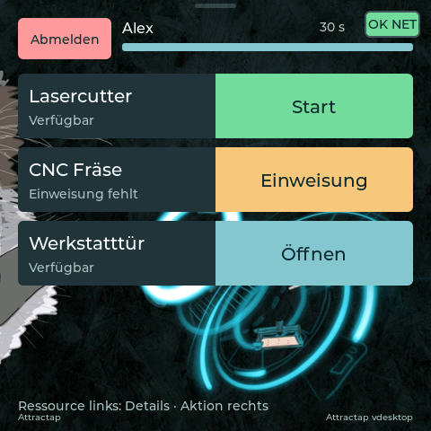
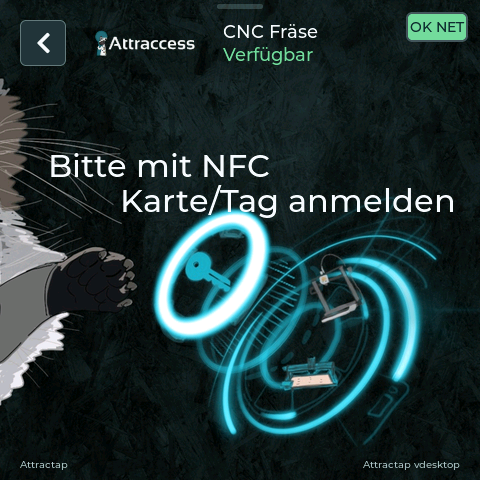
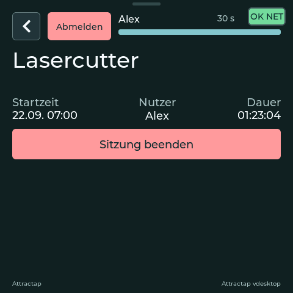
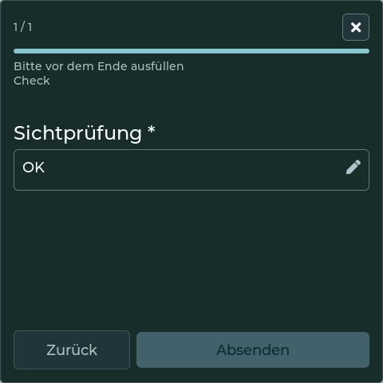

# Den Attractap-Leser benutzen

Mit Ihrer NFC-Karte und dem Attractap-Touchdisplay können Sie die Nutzung einer Maschine starten oder beenden, eine Tür öffnen oder eine Aufsicht anfordern. Der Leser zeigt die ihm zugeordneten Maschinen und Türen sowie die für Sie verfügbaren Aktionen.

Sie benötigen eine NFC-Karte, die mit Ihrem Attraccess-Konto verknüpft ist. Wenn Sie noch keine haben, bitten Sie Ihr Werkstattteam, eine Karte für Sie zu registrieren.

## Mit der Karte anmelden

1. Halten Sie Ihre Karte an den Leser, bis Ihr Name oben auf dem Bildschirm erscheint.
2. Nehmen Sie die Karte weg. Sie bleiben angemeldet und können eine Maschine oder Tür aus der Liste auswählen.
3. Tippen Sie auf die Aktion **rechts**, um eine Ressource zu nutzen, oder auf ihren Namen **links**, um die Details zu öffnen.

_Oben sehen Sie Ihren Namen und die verbleibende Zeit bis zur automatischen Abmeldung._

Sie können eine Ressource auch **vor der Anmeldung** auswählen. Tippen Sie auf ihren Namen und halten Sie Ihre Karte an den Leser, wenn Sie dazu aufgefordert werden. Nach der Anmeldung öffnen sich die Details. Mit dem Pfeil ganz links in der Kopfzeile gelangen Sie zurück zur Liste.

## Eine Maschine starten oder eine Tür öffnen

Tippen Sie in der Ressourcenliste neben einer Maschine auf **Start** oder neben einer Tür auf **Öffnen**. Füllen Sie gegebenenfalls ein Formular aus oder lassen Sie die angeforderte Aufsicht bestätigen. Warten Sie anschließend auf das Ergebnis auf dem Display.

Während der Leser eine Aktion verarbeitet, sind die Bedienelemente kurzzeitig nicht verfügbar. Warten Sie, bis der Status der Ressource aktualisiert wurde, bevor Sie erneut tippen. Nach dem Start einer Maschine zeigt deren Zeile Ihren Namen und die Schaltfläche **Stop**.

### Ein Projekt auswählen

Um die Maschinennutzung einem Projekt zuzuordnen, öffnen Sie über den Namen der Maschine deren Details. Tippen Sie auf **Projekt wählen**, wählen Sie Ihr Projekt aus und starten Sie die Nutzung dort. Wenn Sie direkt aus der Liste starten, wird die Nutzung ohne Projekt erfasst.

## Die Nutzung einer Maschine beenden

1. Falls Sie inzwischen abgemeldet wurden, halten Sie Ihre Karte erneut an den Leser.
2. Tippen Sie neben der von Ihnen genutzten Maschine auf **Stop**. Alternativ können Sie ihre Details öffnen und auf **Sitzung beenden** tippen.
3. Füllen Sie gegebenenfalls das Formular zum Nutzungsende aus und warten Sie, bis das Display das Ende der Nutzung bestätigt.

_Mit dem Zurück-Pfeil gelangen Sie wieder zur Ressourcenliste. Beim Wechsel zwischen Liste und Details bleiben Sie angemeldet._

> [!IMPORTANT]
> **Abmelden** beendet Ihre Anmeldung am Leser. Eine laufende Maschinennutzung wird dadurch **nicht** beendet. Nutzen Sie **Stop** oder **Sitzung beenden**, wenn Sie mit der Maschine fertig sind.

## Ein erforderliches Formular ausfüllen

Ihre Werkstatt kann vor dem Start oder Ende einer Nutzung Angaben abfragen, zum Beispiel zum Zustand der Maschine oder zum verwendeten Material.

1. Tippen Sie auf das Feld, um eine Antwort einzugeben oder auszuwählen. Mit **\*** markierte Felder sind Pflichtfelder.
2. Tippen Sie auf **Weiter**, wenn es weitere Fragen gibt.
3. Tippen Sie bei der letzten Frage auf **Absenden** und warten Sie, bis die Aktion abgeschlossen ist.

Zum Abbrechen tippen Sie auf das **×** oben rechts. Sie kehren zur Liste oder zu den Details zurück, von wo aus Sie die Aktion begonnen haben. Wenn Sie ein erforderliches Formular abbrechen, wird auch die Anfrage zum Starten oder Beenden der Nutzung abgebrochen.

## Eine Aufsicht anfordern

Steht auf der Schaltfläche **Aufsicht**, können Sie darüber eine beaufsichtigte Nutzung anfragen. Bitten Sie einen für diese Ressource berechtigten Einweiser, die Aufsicht zu übernehmen.

Die Aufsicht kann ihre Karte an den Leser halten oder die Anfrage in Attraccess auf dem Smartphone oder Computer bestätigen. Folgen Sie anschließend den weiteren Aufforderungen und warten Sie auf die Bestätigung, dass die Maschinennutzung gestartet wurde.

Tippen Sie auf **Abbrechen**, wenn Sie nicht fortfahren möchten. Sie bleiben angemeldet und können eine andere Ressource auswählen.

## Die weiteren Schaltflächen verstehen

Welche Aktion verfügbar ist, hängt von Ihren Berechtigungen und dem aktuellen Zustand der Ressource ab. Über den Ressourcennamen können Sie die Details auch dann öffnen, wenn Sie die Nutzung nicht starten können.

| Anzeige        | Was Sie tun können                                                                                                                                                       |
| -------------- | ------------------------------------------------------------------------------------------------------------------------------------------------------------------------ |
| **Einweisung** | Sie benötigen eine Einweisung, bevor Sie diese Ressource nutzen können. Öffnen Sie die Details für weitere Hinweise und wenden Sie sich an einen berechtigten Einweiser. |
| **Belegt**     | Eine andere Person nutzt die Maschine. Warten Sie, bis diese ihre Nutzung beendet hat.                                                                                   |
| **Übernehmen** | Die Übernahme der laufenden Nutzung ist erlaubt. Tippen Sie auf die Schaltfläche, um die Details zu öffnen, und wählen Sie dort die Übernahme aus.                       |
| **Gesperrt**   | Die Ressource ist wegen einer Wartung oder eines gemeldeten Problems für Sie nicht verfügbar. Wenden Sie sich an Ihr Werkstattteam.                                      |
| **Laden ...**  | Der Leser prüft, welche Aktionen für Sie verfügbar sind. Warten Sie, bis sich die Schaltfläche aktualisiert.                                                             |

## Zum Schluss abmelden

Tippen Sie oben auf **Abmelden**. Der Leser meldet Sie auch nach **30 Sekunden ohne Bedienung** automatisch ab. Der Countdown und der Balken zeigen die verbleibende Zeit. Eine Berührung des Displays setzt den Countdown zurück. Während der Leser eine Aktion verarbeitet, pausiert er.

Nach der Abmeldung können Sie sich mit Ihrer Karte erneut anmelden. Eine laufende Maschinennutzung bleibt aktiv, auch wenn der Leser Sie automatisch abmeldet.

## Wenn etwas nicht funktioniert

| Was Sie sehen                              | Was Sie tun können                                                                                                                                                                                                |
| ------------------------------------------ | ----------------------------------------------------------------------------------------------------------------------------------------------------------------------------------------------------------------- |
| Die Anmeldung mit Ihrer Karte klappt nicht | Versuchen Sie es erneut und lassen Sie die Karte am Leser, bis die Anmeldung abgeschlossen ist. Falls es weiterhin nicht klappt, bitten Sie Ihr Werkstattteam zu prüfen, ob die Karte Ihrem Konto zugeordnet ist. |
| Start, Stop oder Türöffnung schlägt fehl   | Lesen Sie die Meldung und prüfen Sie vor einem erneuten Versuch den aktuellen Status der Ressource. Wenden Sie sich bei anhaltenden Problemen an Ihr Werkstattteam.                                               |
| Der Leser verliert die Verbindung          | Warten Sie, bis die Verbindung wiederhergestellt ist, und melden Sie sich erneut an. Ein Verbindungsabbruch beendet keine laufende Maschinennutzung.                                                              |

## Weiterführende Anleitungen

- [Ressourcen nutzen](end-user/using-resources.md) – Maschinen und Werkzeuge über die Attraccess-App nutzen
- [NFC-Karten](attractap/nfc-cards.md) – Karten registrieren und verwalten
- [Einweisungen](resources/introductions.md) – Wie Sie Zugang zu einer Ressource erhalten
